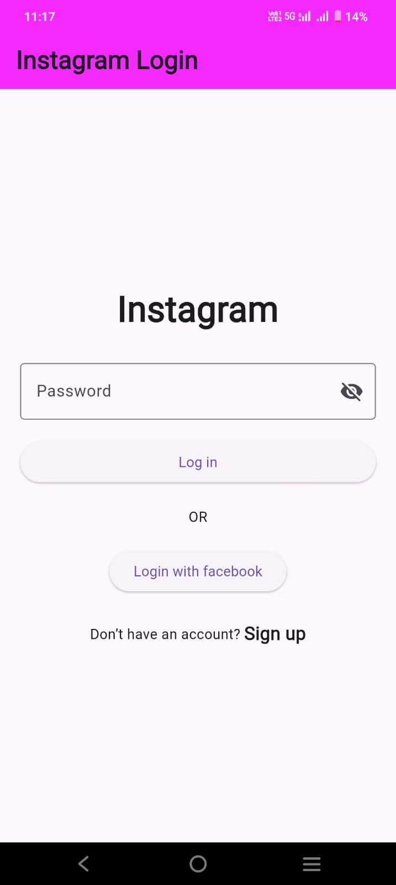

# Instagram Login UI (Flutter)

A clean and simple Instagram login screen built using Flutter.  
This project focuses on UI design and layout practice.

---

## 📸 Screenshot

  

---

## 🚀 Features

- Clean UI design
- Responsive layout
- Beginner-friendly structure

---

## 🛠 Tech Stack

- Flutter
- Dart

---

## 📂 Project Structure

- lib/ → Main app code
- assets/images/ → Screenshots

---

## ▶️ How to Run

1. Clone the repository
2. Run `flutter pub get`
3. Run `flutter run`